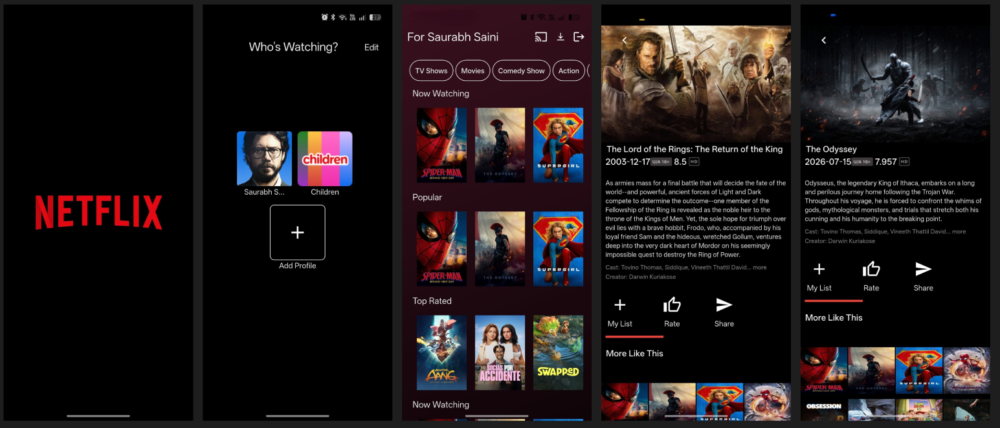

# 🎬 Cinematic Stream

> A full-featured streaming media application built with Flutter, following Clean Architecture principles and powered by TMDB API.


## 📱 Screenshots

<!-- أضف screenshots هنا - صوّر التطبيق وارفع الصور -->
| Home | Details | Search |
|------|---------|--------|
|  |  |  |

## 🏗️ Architecture

This app follows **Clean Architecture** with clear separation of concerns:
lib/ ├── core/ # Shared utilities, constants, themes │ ├── network/ # Dio client, API interceptors │ ├── error/ # Failure classes, exceptions │ └── utils/ # Constants, helpers ├── features/ │ ├── movies/ │ │ ├── data/ # Models, data sources, repository impl │ │ ├── domain/ # Entities, use cases, repository interface │ │ └── presentation/ # BLoC, screens, widgets │ ├── search/ │ └── favorites/ └── injection_container.dart # Dependency injection setup


## 🔧 Tech Stack

| Category | Technology |
|----------|-----------|
| **Framework** | Flutter 3.x |
| **Language** | Dart |
| **State Management** | BLoC / Cubit |
| **Networking** | Dio with interceptors |
| **API** | TMDB REST API |
| **Animations** | Lottie |
| **Architecture** | Clean Architecture + Repository Pattern |
| **DI** | GetIt |

## ✨ Key Features

- ✅ Browse 10K+ movies and TV shows with infinite scroll pagination
- ✅ Detailed movie pages with cast, reviews, and similar recommendations
- ✅ Real-time search with debouncing for optimal API usage
- ✅ Smooth Lottie animations and shimmer loading effects
- ✅ Responsive design adapting to multiple screen sizes
- ✅ Error handling with retry mechanisms
- ✅ Clean Architecture ensuring testable, maintainable code

## 📊 Performance Highlights

- 🚀 Lazy loading with pagination — only loads data as needed
- 🚀 Image caching for smooth scrolling at 60fps
- 🚀 BLoC state management reducing unnecessary widget rebuilds
- 🚀 Optimized network calls with Dio interceptors and response caching

## 🏃 Getting Started

### Prerequisites
- Flutter SDK 3.x+
- Dart SDK 3.x+
- TMDB API Key ([Get one here](https://www.themoviedb.org/documentation/api))

### Installation

```bash
# Clone the repository
git clone https://github.com/asherifo/cinematic-stream.git

# Navigate to project
cd cinematic-stream

# Install dependencies
flutter pub get

# Add your TMDB API key
# Open lib/core/utils/constants.dart and add your API key

# Run the app
flutter run
